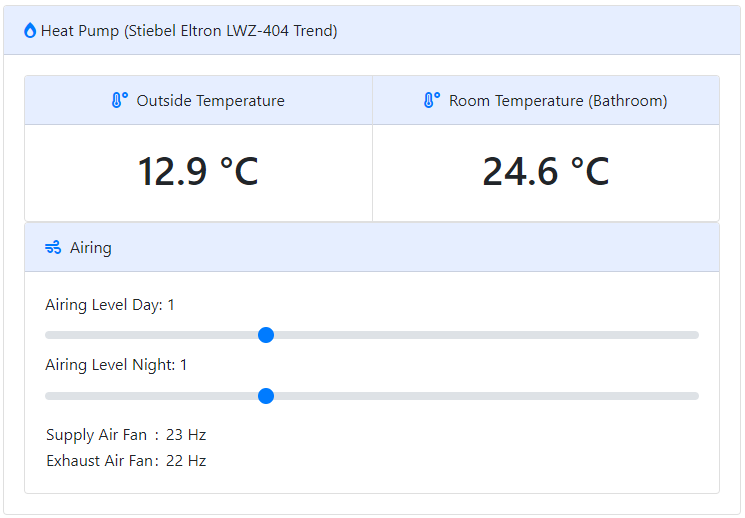

# mblwz - modbus (Stiebel Eltron) LWZ (404 Trend controller and reader)
A [raspend](https://github.com/jobe3774/raspend) based application to control my **Stiebel Eltron LWZ 404 Trend** heat pump via HTTP.

It uses [pyModbusTCP](https://github.com/sourceperl/pyModbusTCP) for controlling and reading out current values of my heat pump.

  Here is a screenshot of my frontend to display the data collected by mblwz.

